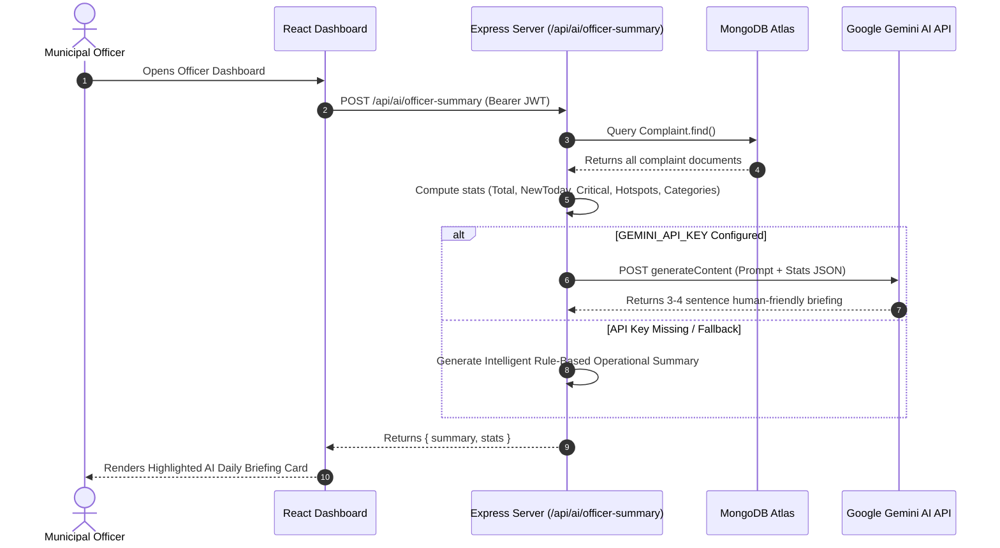

# 🏛️ Citizen Complaint Portal

<div align="center">
  
  <h3>Modern MERN Stack Civic Tech & Grievance Redressal System</h3>
  <p>Connecting citizens and municipal officers for transparent, AI-powered civic issue resolution.</p>
</div>

---

## 📌 Overview

**Citizen Complaint Portal** is a web platform designed to streamline civic grievance reporting and municipal workflow management. Citizens can report local infrastructure problems—such as damaged roads, garbage accumulation, water supply interruptions, or streetlight failures—and track resolution progress in real time. 

Municipal officers receive a dedicated dashboard equipped with **AI-generated daily operational briefings**, dynamic complaint priority scoring, real-time duplicate complaint detection, and multi-criteria reporting tools.

---

## ✨ Implemented Core Features

### 👤 User Authentication & Role-Based Access Control
- **Dual User Roles**: **Citizen** and **Officer/Admin** user accounts.
- **Secure Authentication**: JWT-based session management with encrypted passwords (`bcryptjs`).

### 📝 Grievance Filing & Duplicate Prevention
- **Category & Locality Selection**: Categorized filing across *Roads & Infrastructure*, *Garbage & Sanitation*, *Water Supply*, *Electricity & Power Grid*, and *Other*.
- **Real-Time Duplicate Complaint Detection**: Automatically queries active complaints in the same category & locality while typing, nudging citizens to upvote existing issues instead of filing duplicates.
- **Reference Image URL**: Optional photo URL reference attachment for visual proof.

### 📈 Dynamic Priority Scoring Engine
- Auto-calculates urgency scores for every complaint using the formula:
  $$\text{Score} = (\text{Upvotes} \times 2) + \text{DaysSinceCreated}$$
- Maps score dynamically to visual urgency badges:
  - 🟢 **Low Priority** ($\text{Score} < 5$)
  - 🟡 **Medium Priority** ($\text{Score } 5 - 15$)
  - 🟠 **High Priority** ($\text{Score } 16 - 30$)
  - 🔴 **Critical Priority** ($\text{Score} > 30$)

### 🤖 AI Daily Operations Briefing (Google Gemini API Integration)
- **Deep AI Analysis**: Integrated with **Google Gemini API** (`gemini-1.5-flash`) via `GEMINI_API_KEY`.
- **How It Works**:
  1. When an officer logs in, the backend (`POST /api/ai/officer-summary`) fetches all complaint records from MongoDB.
  2. The system computes real-time operational statistics:
     - Total complaint volume & new complaints filed today.
     - Active status counts (`Pending`, `In Progress`, `Resolved`).
     - Number of **Critical Priority** cases (score > 30).
     - Top grievance category (e.g. *Roads & Infrastructure*) and primary hotspot locality (e.g. *Sector 4*).
  3. These computed stats are passed as structured context to the Gemini AI model with a specialized government operations prompt.
  4. Gemini generates a **human-friendly, 3 to 4 sentence natural-language briefing card** (e.g., *"Today: 12 new grievance reports filed. Currently 5 complaints require pending officer dispatch. 3 complaints reached Critical priority based on high community upvotes. Top grievance category is 'Roads' with primary hotspot in 'Sector 4'."*).
  5. Includes a **Refresh AI Briefing** button on the UI for real-time situational awareness.
  6. Equipped with an **Intelligent Fallback Engine** ensuring seamless operations even if Gemini API keys are omitted or rate-limited.

### 🛡️ Officer Management & Status Controls
- **Status Updates**: Change complaint status (`Pending` ➔ `In Progress` ➔ `Resolved`).
- **Official Remarks**: Officers add progress remarks and expected resolution timelines.

### 📊 One-Click CSV Data Export
- Officers can download the filtered complaint database as a `.csv` spreadsheet formatted as `complaints_export_YYYY-MM-DD.csv` via `json2csv`.

### ⭐ Citizen Resolution Feedback
- Once an issue is marked **Resolved**, the filing citizen is prompted to rate redressal satisfaction (1–5 Stars) and leave feedback notes.

---

## 🤖 Deep Dive: Google Gemini AI Integration Architecture

Here is the exact technical flow of how Google Gemini AI powers the Officer Dashboard:



---

## 🌟 Implemented Advanced Extra Features

The application goes far beyond standard CRUD portals by implementing **5 major high-impact extra features**:

| Implemented Extra Feature | Tech / API Used | Value Provided | Status |
| :--- | :--- | :--- | :---: |
| 🤖 **AI Daily Operations Briefing** | **Google Gemini AI API** (`gemini-1.5-flash`) | Generates a 3–4 sentence plain-English operational summary for municipal officers by analyzing live MongoDB complaint metrics & hotspots. | **✅ Built & Live** |
| 🔍 **Real-Time Duplicate Detection** | MongoDB Locality Query Engine | Automatically scans active complaints in the same category & area while typing, nudging citizens to upvote existing issues. | **✅ Built & Live** |
| 📈 **Dynamic Priority Scoring** | Custom Algorithmic Engine | Auto-computes urgency score: $\text{Score} = (\text{Upvotes} \times 2) + \text{DaysSinceCreated}$, mapping to `Low`, `Medium`, `High`, and `Critical` badges. | **✅ Built & Live** |
| 📊 **One-Click CSV Data Export** | `json2csv` Parser & Streamer | Streams filtered complaint records into downloadable `.csv` spreadsheets (`complaints_export_YYYY-MM-DD.csv`) for government audits. | **✅ Built & Live** |
| ⭐ **Citizen Satisfaction Rating** | Mongoose Feedback Schema | Prompts citizens upon resolution to rate redressal satisfaction (1–5 Stars) and submit feedback notes. | **✅ Built & Live** |

---

## 🚀 Future Roadmap Features

Here are the planned extensions for upcoming production iterations:

| Feature | Category | Description |
| :--- | :--- | :--- |
| 📸 **Cloudinary Direct File Upload** | File Upload | Direct image uploads from device camera/gallery via Multer & Cloudinary CDN. |
| 🗺️ **GIS Locality Heatmap** | Mapping | Interactive Leaflet / Google Maps view showing real-time complaint pins and urgency heatmaps. |
| 🔔 **SMS & Push Notifications** | Real-Time | Twilio SMS and Web Push alerts notifying citizens whenever complaint status updates or officer adds remarks. |
| 📊 **Chart.js Executive Analytics** | Analytics | Visual analytics dashboard showing resolution SLA trends, category breakdowns, and officer performance metrics. |
| ⚡ **Socket.io Live Synchronization** | Real-Time | Instant live feed updates across citizen and officer screens without manual page refreshes. |
| 🏆 **Civic Leaderboard & Gamification** | Engagement | Badges and civic karma points rewarded to active citizens who report and upvote community issues. |

---

## 🛠️ Tech Stack

### **Frontend**
- **Framework**: React.js (Vite)
- **Styling**: Tailwind CSS & Vanilla CSS
- **Icons**: Lucide React
- **Routing**: React Router DOM (v6)
- **Notifications**: React Hot Toast

### **Backend**
- **Runtime**: Node.js & Express.js
- **Database**: MongoDB & Mongoose ORM
- **Authentication**: JSON Web Tokens (JWT) & BcryptJS
- **CSV Processing**: `json2csv`
- **Async Handling**: `express-async-handler`

### **AI Services**
- **Model**: Google Gemini API (`gemini-1.5-flash`)

---

## 📁 Directory Structure

```
Hackathon-Project/
├── client/                     # React Frontend (Vite)
│   ├── public/
│   │   └── logo.png            # Official Portal Logo
│   ├── src/
│   │   ├── api/                # Axios API Service Layer
│   │   ├── components/         # Modals, Layouts, & Complaint Views
│   │   ├── context/            # AuthContext & State Management
│   │   ├── pages/              # Dashboard, Home, Login, Signup, Profile
│   │   ├── App.jsx             # Main Application Routing
│   │   └── main.jsx            # React Entry Point
│   └── package.json
│
└── server/                     # Node.js Express Backend
    ├── config/                 # DB Connection Settings
    ├── controllers/            # Complaint, Auth, AI, & User Controllers
    ├── middleware/             # JWT & Officer Authorization Middleware
    ├── models/                 # Mongoose Schemas (User, Complaint)
    ├── routes/                 # Express API Endpoints
    ├── server.js               # Express Application Server
    └── package.json
```

---

## ⚡ Getting Started

### Prerequisites
- Node.js (v18.0.0 or higher)
- MongoDB Atlas Cluster or local MongoDB instance

### 1. Environment Setup

Create a `.env` file inside the `server/` directory:

```env
PORT=5000
MONGO_URI=your_mongodb_connection_string
JWT_SECRET=your_jwt_secret_key
GEMINI_API_KEY=your_google_gemini_api_key
```

Create a `.env` file inside the `client/` directory:

```env
VITE_API_URL=https://hackathon-project-sepia-iota.vercel.app/api
```

### 2. Install Dependencies

```bash
# Install Server Dependencies
cd server
npm install

# Install Client Dependencies
cd ../client
npm install
```

### 3. Run Development Server

```bash
# Start Express Backend Server
cd server
npm run dev

# Start Vite Frontend Dev Server (in a new terminal)
cd client
npm run dev
```

Open [http://localhost:5173](http://localhost:5173) in your browser.

---

## 📡 API Endpoint Reference

| Method | Endpoint | Description | Access |
| :--- | :--- | :--- | :--- |
| `POST` | `/api/auth/signup` | Register new user account | Public |
| `POST` | `/api/auth/login` | Authenticate user & return JWT token | Public |
| `POST` | `/api/complaints` | File a new civic complaint | Citizen |
| `GET` | `/api/complaints` | Fetch all complaints (with search/filter query) | Public |
| `GET` | `/api/complaints/mine` | Fetch logged-in user's complaints | Citizen |
| `GET` | `/api/complaints/check-duplicate` | Scan active complaints in same area/category | Public |
| `GET` | `/api/complaints/export` | Download filtered complaints as `.csv` | Officer |
| `PATCH` | `/api/complaints/:id/upvote` | Upvote a complaint | Citizen |
| `PATCH` | `/api/complaints/:id/status` | Update complaint status & officer remark | Officer |
| `PATCH` | `/api/complaints/:id/feedback` | Submit citizen satisfaction rating (1–5 Stars) | Citizen Owner |
| `POST` | `/api/ai/officer-summary` | Generate AI operational briefing summary | Officer |

---

## 📄 License

This project is open-source and built for civic technology hackathons.
